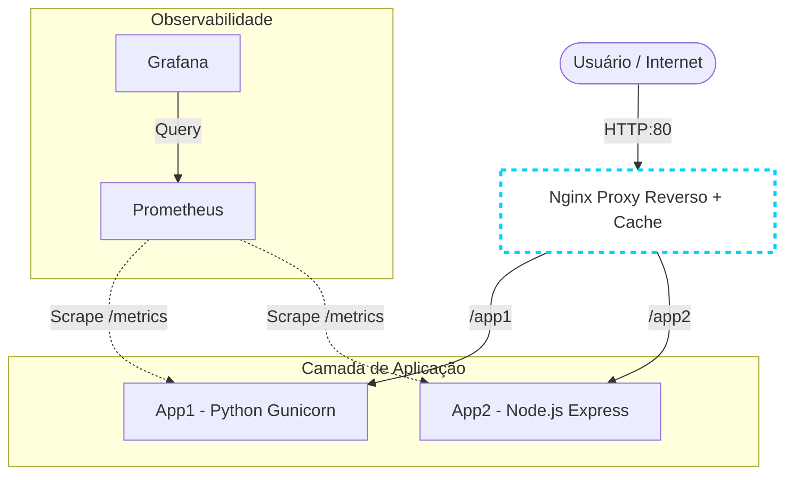
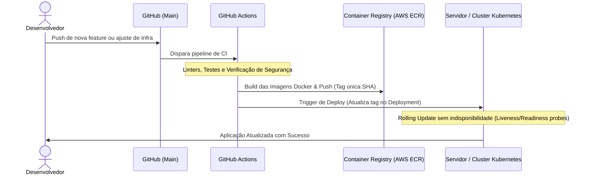

# Desafio DevOps 2025

Este repositório contém a solução para o Desafio DevOps, apresentando uma infraestrutura conteinerizada, com proxy reverso gerenciando o cache em diferentes camadas, e uma stack completa de observabilidade.

## Como executar

Atendendo estritamente ao requisito de "iniciar e rodar com o menor número de comandos possível", a infraestrutura local foi orquestrada via Docker Compose.

1. Clone o repositório:
   ```bash
   git clone <seu-repositorio>
   cd <pasta-do-repositorio>
    ```
2. Suba a infraestrutura:
 ```bash
   docker compose up -d
 ```
(Nota: O Nginx possui um mecanismo de depends_on atrelado aos healthchecks das aplicações. Ele aguardará as APIs estarem 100% prontas antes de iniciar, garantindo zero downtime no boot da stack).


## Testando a Camada de Cache
Para verificar o roteamento correto das aplicações e o cache atuando, utilize o comando curl -i (que exibe os cabeçalhos e o corpo da resposta). Observe o header customizado X-Cache-Status implementado no Nginx.

Passo 1: Testar o roteamento da App 1 (Python):

```Bash
curl -i http://localhost/app1/
```
Saída esperada (provando que o Nginx direcionou para o container correto):

```
HTTP/1.1 200 OK
Server: nginx/1.29.5
...
X-Cache-Status: MISS

Aplicação 1 - Python
```
Passo 2: Testar o cache de 10 segundos da App 1:

```Bash
curl -i http://localhost/app1/time
```
Saída esperada executando duas vezes seguidas (HIT indica que a resposta veio da memória do Nginx):

```
HTTP/1.1 200 OK
Server: nginx/1.29.5
...
X-Cache-Status: HIT

Horário atual (App1): 2026-03-02T13:53:28.964492
```
(No HIT o horário congela por 10 segundos. Após esse tempo, um novo MISS ou EXPIRED ocorrerá e o horário será atualizado).

Passo 3: Testar o roteamento da App 2 (Node.js):

```Bash
curl -i http://localhost/app2/
```
Saída esperada (notando os cabeçalhos específicos do framework Express):

```
HTTP/1.1 200 OK
Server: nginx/1.29.5
...
X-Powered-By: Express
X-Cache-Status: EXPIRED

Aplicação 2 - Node.js
```
Passo 4: Testar o cache de 60 segundos da App 2:

```Bash
curl -i http://localhost/app2/time
```
Saída esperada:

```
HTTP/1.1 200 OK
Server: nginx/1.29.5
...
X-Powered-By: Express
X-Cache-Status: EXPIRED

Horário atual (App2): 2026-03-02T13:55:37.225Z
```
(A mesma lógica de validação do Python se aplica, porém o Nginx reterá essa resposta da App 2 congelada na memória por 1 minuto inteiro antes de buscar um novo horário).


## Desenho da Arquitetura
A arquitetura foi desenhada para que as aplicações sejam stateless. O Nginx centraliza a responsabilidade do cache (Layer 7), permitindo escalabilidade horizontal das linguagens no backend de forma transparente.



## Fluxo de Atualização (CI/CD)
No cenário proposto de produção, as atualizações de infraestrutura e código seguem uma abordagem GitOps utilizando GitHub Actions configurado com runners adequados para CI e CD. O fluxo abaixo detalha a jornada do código até o deploy seguro:


    
## Identificação e Sugestões de Melhoria
Para cumprir o requisito de iniciar com o menor número de comandos possível para a avaliação, a infraestrutura principal foi orquestrada via Docker Compose. No entanto, pensando em um ambiente de produção corporativo, resiliente e escalável, criei a pasta k8s/ contendo os manifestos Kubernetes estruturados (Deployments, Services e ConfigMaps).

Minhas sugestões de melhoria e próximos passos para evolução dessa arquitetura em nuvem incluem:

a. Deploy em Cluster Gerenciado (Ex: AWS EKS / ECS):

   *Utilizar os manifestos da pasta k8s/ para provisionar a aplicação em um cluster escalável. O repositório de imagens passaria a ser um serviço gerenciado, como o Amazon ECR, integrado diretamente na esteira do GitHub Actions.

b. Escalonamento Automático (HPA):

   *Os manifestos já incluem requests e limits de CPU/Memória. O próximo passo é configurar um Horizontal Pod Autoscaler baseado no consumo de recursos ou na métrica de requisições por segundo exportada pelo Prometheus.

c. Segurança de Acessos e Redes (VPC & IAM): 

   *Isolar os worker nodes do cluster em sub-redes privadas e endpoints (VPC Endpoints) para serviços internos, expondo apenas o proxy reverso através de um Ingress Controller público. 
   
   *Em vez de credenciais estáticas, adotar IAM Roles no Kubernetes (IRSA) ou Task Roles no ECS, garantindo privilégios mínimos (Least Privilege) para cada pod.
   
d. Gestão do Nginx Proxy e Observabilidade: 

   *Centralizar os logs de acesso e erros do Nginx enviando-os para um agregador de logs, complementando as métricas do Prometheus/Grafana já implementadas para uma observabilidade 360º.


